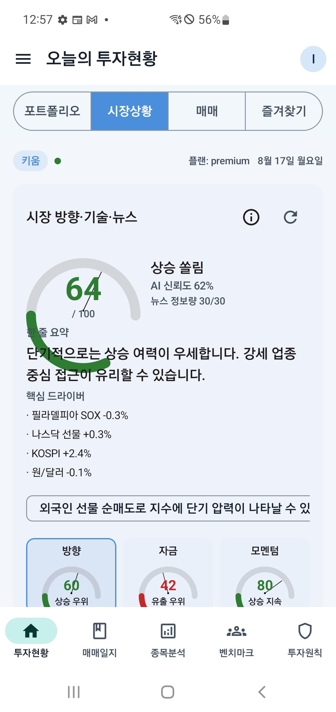
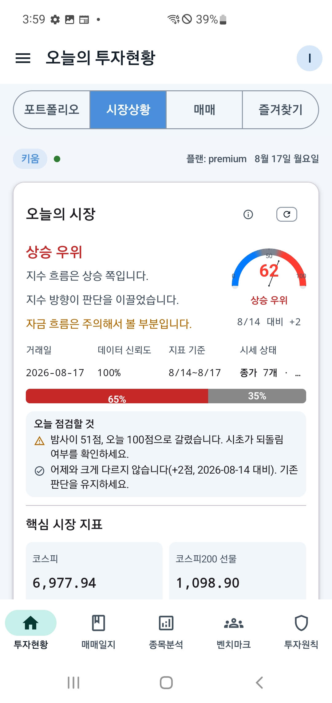

# iOS to Android UI Parity Skill


A Cursor Skill for porting SwiftUI screens to Android Jetpack Compose while preserving product design, visual hierarchy, behavior, accessibility, localization, and cross-platform consistency.

## Why this exists

A SwiftUI screen can be functionally reproduced in Jetpack Compose and still look or feel noticeably different. Common causes include different default padding, typography metrics, component defaults, icon geometry, system insets, Canvas constraints, device-size variation, font scaling, localization, and RTL behavior.

This Skill guides Cursor to preserve the same product experience instead of mechanically translating framework components.
## Before / After

| iOS Reference -> before | Android with UI Parity Skill -> after |

<table>

<tr>
<td></td>
<td></td>
</tr>

</table>

reference : ios ATUS AI APP
ios app link : https://l.threads.com/?u=https%3A%2F%2Fapps.apple.com%2Fkr%2Fapp%2Fatus-ai%2Fid6761884312&e=AUDfwec6gHkbmtHzqvqImtBQzsbiBuJVdJ_0vVtbjsGz-HhBj0b5PmXuXkkDBjwytTO3j7W-TJLEh8l1ZxJ_yhMyPDzz2ZUFHhm0Owm6YFs_0Uj2zHJ_sr7f3I2D_X_P7Dp0uBfQE7Ac

## Core goal

```text
iOS Reference
    ↓
Design Intent
    ↓
Shared Product Rules
    ↓
Platform-Native Android Implementation
    ↓
Visual and Behavioral Validation
    ↓
Same Product Experience
```

The target is not pixel-perfect copying at any cost. The target is the same information hierarchy, functional behavior, visual intent, product identity, and correct Android accessibility and system behavior.

## What it covers

- SwiftUI → Jetpack Compose migration workflow
- Visual parity and responsive layout
- Design token extraction
- typography, line height, and vertical rhythm parity
- buttons, text fields, cards, and icons
- Android edge-to-edge and system insets
- Accessibility and font scaling
- Localization and RTL
- Navigation parity
- Shared backend API contracts
- Platform-specific feature mapping
- Screenshot comparison
- Multi-device validation
- Gauge, donut, chart, progress arc, and Canvas validation
- Visual regression failure criteria

## Install

Copy `SKILL.md` into your Cursor project.

```text
.cursor/
└── skills/
    └── ios-android-ui-parity/
        └── SKILL.md
```

## Recommended usage

For a new screen migration:

```text
Use the iOS to Android UI Parity Skill.

Reference:
ios/StockDetailView.swift

Target:
android/.../StockDetailScreen.kt

Use the existing iOS screenshot as the primary visual source of truth.
Preserve the existing backend API contract.
Implement only the files required for this screen and its dependencies.
Do not reinterpret the UI using Material defaults.
Preserve accessibility, localization, RTL support, and Android system behavior.
```

For visual correction:

```text
Use the iOS to Android UI Parity Skill.

Compare the attached iOS and Android screenshots.
Fix only the visual and platform-parity differences.

Prioritize:
1. layout
2. spacing
3. typography
4. component dimensions
5. colors
6. icon alignment
7. gauges/charts/Canvas constraints
8. system insets
9. accessibility
10. localization and RTL behavior

Do not modify business logic unless required.
```

## Gauge and Canvas example

A common migration failure is a custom visual component receiving unconstrained space and overlapping adjacent text. The screen should own placement and available space; the gauge should own rendering. Use a bounded parent and explicit component size, and avoid absolute x/y offset fixes.

## Repository structure

```text
ios-android-ui-parity-skill/
├── SKILL.md
├── README.md
├── LICENSE
├── CHANGELOG.md
├── examples/
│   ├── screen-porting.md
│   ├── visual-fix.md
│   └── gauge-layout.md
└── docs/
    ├── workflow.md
    └── visual-parity-checklist.md
```

## Contributing

Issues and pull requests are welcome, especially around migration edge cases, screenshot comparison workflows, accessibility, RTL, custom chart/Canvas parity, and reusable design-token strategies.

## License

MIT
